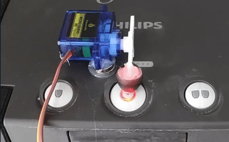

## Node MCU Button Pusher




## Purpose
Sets up a REST interface on a Node MCU to control a servo motor. Used as a low-cost button pusher to smart up appliances and light switches.

## Setup
Create a file called `wlan.config` with the following contents:

```
SSID=your_ssid
PASS=your_password
```

Then run `bake.sh` to create the .ino file from the template and bake the values into the appropriate variables (this is mostly me freaking out about accidentally pushing my password to the repo...).

I use a bunch of [inexpensive servo motors](https://www.amazon.de/gp/product/B07DNVGVLC/) which can easily be fixated to most appliances using [neodymium magnets](https://www.amazon.de/Neodym-Magnete-St%C3%BCck-Extrem-Haftst%C3%A4rke/dp/B06X977K8L) (I do recommend using more than one magnet to avoid the servo pushing itself up instead of pushing the button).

The **D4** pin is being used as data line.

## Usage
The RESTful interface offers two endpoints:

### `GET /servo`

Retrieves the current state of the servo. Not really used.

### `POST /servo`

Causes the servo to perform a button push. A JSON payload is expected to specify `angle` (in degree) and `duration` (in milliseconds).

```
curl -d '{"angle":"50", "duration":"500"}' -H "Content-Type: application/json" -X POST http://MYNODEMCU/data
```

Performs a 50 degree pushdown for 500 milliseconds before going back to neutral position.

## Integrating into Home Assistant

I use this tool to heat up my coffee maker in the morning using a [Home Assistant](https://www.home-assistant.io/) script. For that I use the following entry in my `configuration.yaml` to use it as a script:

```yaml
rest_command:
  get_servo_state:
    url: "http://MYNODEMCU/servo"
    method: "get"
  push_servo_button:
    url: "http://MYNODEMCU/servo"
    method: "post"
    content_type: "application/json; charset=utf-8"
    payload: "{'angle': '{{ angle }}', 'duration': '{{ duration }}'}"

```